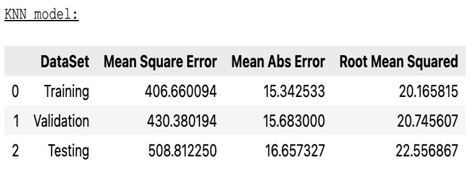

Machine Learning Data-Driven Insights: Predicting Cancer Mortality Rates
Using Census Data in US Counties

**<u>Project Overview</u>**

This project aims to develop a regression model that predicts cancer
mortality rates in counties across the United States using census data.
The given dataset is unified by aggregating census data from across the
United States. The primary objective is to explore the relationships
between various demographic and medical factors and their impact on
cancer mortality rates. This analysis can provide valuable insights for
public health planning and resource allocation.

The objective of this project is to build a regression model that
accurately predicts cancer mortality rates based on various features
extracted from the US census data. By performing data exploration,
cleaning, and feature selection, identify the most relevant factors
influencing mortality rates and develop a model that can be used to
predict these rates on unseen data. This model could help in
understanding key determinants of cancer mortality and aid in targeted
public health interventions.

Additionally, the resulting model can also be used to obtain valuable
insights into the associations between various factors and variables
that impact cancer mortality rates. This information can then be
employed by healthcare professionals (both public and private),
policymakers, and researchers to create better strategies for decreasing
cancer mortality rates. Additionally, informed decision-making processes
can be implemented to enhance health results and services.

**<u>Business Problem</u>**

The primary business problem is to build a (Supervised Machine Learning)
Univariate/Multivariate Linear Regression model that can accurately
predict cancer mortality rates using data related to counties in the
United States. The model aims to identify the most significant
individual or multiple features that affect cancer mortality, providing
insights that could be used for public health decision-making and
resource allocation.

**<u>Datasets</u>**

The dataset provided is consolidated from US census data and consists of
33 features related to demography and medical information at the county
level such as medical coverages of people, their average age, education,
employment. The dataset is split into two parts:

-   **Training Set**: **cancer\_us\_county-training.csv** - Used to
    train the regression model.

-   **Testing Set**: **cancer\_us\_county-testing.csv** - Used to
    evaluate the performance of the model.

**Data Dictionary**

-   TARGET\_deathRate: Mean per capita (per 100,000) cancer mortalities.

-   avgAnnCount: Mean number of reported cases of cancer diagnosed
    annually.

-   avgDeathsPerYear: Mean number of reported mortalities due to cancer.

-   incidenceRate: Mean per capita (per 100,000) cancer diagnoses.

-   medianIncome: Median income per county.

-   popEst2015: Population estimate of the county in 2015.

-   povertyPercent: Percent of the population in poverty.

-   studyPerCap: Per capita number of cancer-related clinical trials per
    county.

-   binnedInc: Median income per capita binned by decile.

-   MedianAge: Median age of county residents.

-   MedianAgeMale: Median age of male county residents.

-   MedianAgeFemale: Median age of female county residents.

-   Geography: County name.

-   AvgHouseholdSize: Mean household size of the county.

-   PercentMarried: Percent of county residents who are married.

-   ...and other features related to education, employment, insurance
    coverage, race, and birth rates.

**<u>Data Preparation</u>**

-   **Determining attributes types and Null values of features**

In the dataset, most attributes are of an integer(int64), or
decimal(float) data type and only two are of string/character(object)
data type. The following table provides a short description of the
datasets, their datatypes and attribute names and descriptions.

Table 1: Training dataset highlighting null values.

Table 2: Testing dataset highlighting null values.

-   **Analysing and exploring data**

The data was explored utilizing the below functionalities of the pandas
and seaborn data visualisation library.

Once the initial data exploration stage is completed, the data is
prepared and processed to make it suitable for use with algorithms. As
it’s aggregated data it appears that individual identities were cleaned,
and the quality of data was acceptable to be used as no issues were
encountered except null values.

-   **Handing missing/null values.**

One of the important factors while working on the supervised machine
learning models is that the machine learning algorithms are not capable
of dealing with missing values in continuous attributes or any other
attributes. Therefore, it is necessary to either address the issue of
missing values or eliminate the corresponding columns altogether. And
the usual way is to substitute it with mean value as it is an average of
the ranges of values present in the attribute.

However, from the 'PctSomeCol18\_24' feature more than 70% of the
records are missing (only 612 recorded out of 2438), so it is
impractical to fill them with mean values. Therefore, removing this
feature from both datasets. And the rest features' null values were
replaced with their mean.

-   **Performing featuring engineering.**

For Part C, feature engineering is performed, and additional information
is extracted from ‘binnedInc’ attribute by performing below steps and
stored in ‘binnedInc1’ and ‘binnedInc2’.

**<u>Modelling</u>**

Although Multivariate Linear Regression is used for assignment learning
purposes, it is an appropriate

choice for both univariate and multivariate linear regression because
the target variable,

"TARGET\_deathRate," and all the chosen single/multiple independent
variables are continuous and

can potentially have infinite values. Therefore, Multivariate Linear
Regression is a suitable model

choice for all the experiments.

**<u>Evaluation</u>**

Below are the Performance Metrics of the trained linear regression
algorithms.

-   **Experiment: Part A - I (Univariate Linear Regression)**

<u>Performance Metrics of Univariate Linear Regression</u> with
'incidence Rate' feature.

<table>
<colgroup>
<col style="width: 24%" />
<col style="width: 26%" />
<col style="width: 24%" />
<col style="width: 23%" />
</colgroup>
<tbody>
<tr>
<td>Dataset</td>
<td><blockquote>

MSE

</blockquote></td>
<td><blockquote>

MAE

</blockquote></td>
<td><blockquote>

RMSE

</blockquote></td>
</tr>
<tr>
<td>Baseline</td>
<td><blockquote>

744.585

</blockquote></td>
<td><blockquote>

21.1836

</blockquote></td>
<td><blockquote>

27.287

</blockquote></td>
</tr>
<tr>
<td>Training</td>
<td><blockquote>

612.89

</blockquote></td>
<td><blockquote>

19.3498

</blockquote></td>
<td><blockquote>

24.7566

</blockquote></td>
</tr>
<tr>
<td>Validation</td>
<td><blockquote>

614.1857

</blockquote></td>
<td><blockquote>

19.2027

</blockquote></td>
<td><blockquote>

24.78277

</blockquote></td>
</tr>
<tr>
<td>Testing</td>
<td><blockquote>

622.488

</blockquote></td>
<td><blockquote>

19.7412

</blockquote></td>
<td><blockquote>

24.9497

</blockquote></td>
</tr>
</tbody>
</table>

-   **Experiment: Part A - II (Univariate Linear Regression)**

<u>Performance Metrics of Univariate Linear Regression w</u>ith
'PctPublicCoverageAlone' feature.

<table>
<colgroup>
<col style="width: 25%" />
<col style="width: 27%" />
<col style="width: 25%" />
<col style="width: 21%" />
</colgroup>
<tbody>
<tr>
<td>Dataset</td>
<td><blockquote>

MSE

</blockquote></td>
<td><blockquote>

MAE

</blockquote></td>
<td><blockquote>

RMSE

</blockquote></td>
</tr>
<tr>
<td>Baseline</td>
<td><blockquote>

744.585

</blockquote></td>
<td><blockquote>

21.1836

</blockquote></td>
<td><blockquote>

27.287

</blockquote></td>
</tr>
<tr>
<td>Training</td>
<td><blockquote>

579.9413

</blockquote></td>
<td><blockquote>

18.3111

</blockquote></td>
<td><blockquote>

24.0819

</blockquote></td>
</tr>
<tr>
<td>Validation</td>
<td><blockquote>

719.2265

</blockquote></td>
<td><blockquote>

19.9816

</blockquote></td>
<td><blockquote>

26.8184

</blockquote></td>
</tr>
<tr>
<td>Testing</td>
<td><blockquote>

698.2437

</blockquote></td>
<td><blockquote>

19.2253

</blockquote></td>
<td><blockquote>

26.4243

</blockquote></td>
</tr>
</tbody>
</table>

1.  As the difference between the RMSE scores for 3 sets of experiment 1
    is relatively small, it suggests that the model is performing
    consistently across the three sets and is not overfitting to the
    training data and this univariate linear regression model with a
    single 'incidenceRate' independent feature is generalizing well to
    new/unseen data.

<!-- -->

1.  The difference between the RMSE scores for 3 sets of experiment 2 is
    small and it appears that the model's performance is decent but not
    ideal. Therefore, it appears relying solely on the
    'PctPublicCoverageAlone' independent feature is inadequate to make
    precise predictions about cancer mortality rates.

    1.  The model from the first experiment performed consistently for
        all the 3 sets and is generalised fairly to predict cancer
        mortality rate, whereas the model from the second experiment is
        sightly overfitting the training set.

-   **Part B: Experiment 1 (Multivariate Linear Regression)**

<u>Performance Metrics of Multivariate Linea</u>r Regression (with
chosen 6 features)

<table>
<colgroup>
<col style="width: 24%" />
<col style="width: 28%" />
<col style="width: 25%" />
<col style="width: 21%" />
</colgroup>
<tbody>
<tr>
<td>Dataset</td>
<td><blockquote>

MSE

</blockquote></td>
<td><blockquote>

MAE

</blockquote></td>
<td><blockquote>

RMSE

</blockquote></td>
</tr>
<tr>
<td>Baseline</td>
<td><blockquote>

744.585

</blockquote></td>
<td><blockquote>

21.1836

</blockquote></td>
<td><blockquote>

27.287

</blockquote></td>
</tr>
<tr>
<td>Training</td>
<td><blockquote>

397.0357

</blockquote></td>
<td><blockquote>

14.8642

</blockquote></td>
<td><blockquote>

19.9257

</blockquote></td>
</tr>
<tr>
<td>Validation</td>
<td><blockquote>

367.6438

</blockquote></td>
<td><blockquote>

14.672

</blockquote></td>
<td><blockquote>

19.174

</blockquote></td>
</tr>
<tr>
<td>Testing</td>
<td><blockquote>

453.8926

</blockquote></td>
<td><blockquote>

15.758

</blockquote></td>
<td><blockquote>

21.3047

</blockquote></td>
</tr>
</tbody>
</table>

-   **Part B: Experiment 2 (Multivariate Linear Regression)**

<u>Performance Metrics of Multivariate Linear Regressio</u>n (with all
features except a few with object)

<table>
<colgroup>
<col style="width: 25%" />
<col style="width: 27%" />
<col style="width: 25%" />
<col style="width: 21%" />
</colgroup>
<tbody>
<tr>
<td>Dataset</td>
<td><blockquote>

MSE

</blockquote></td>
<td><blockquote>

MAE

</blockquote></td>
<td><blockquote>

RMSE

</blockquote></td>
</tr>
<tr>
<td>Baseline</td>
<td><blockquote>

744.585

</blockquote></td>
<td><blockquote>

21.1836

</blockquote></td>
<td><blockquote>

27.287

</blockquote></td>
</tr>
<tr>
<td>Training</td>
<td><blockquote>

343.6132

</blockquote></td>
<td><blockquote>

13.922

</blockquote></td>
<td><blockquote>

18.5368

</blockquote></td>
</tr>
<tr>
<td>Validation</td>
<td><blockquote>

482.1358

</blockquote></td>
<td><blockquote>

14.9528

</blockquote></td>
<td><blockquote>

21.9575

</blockquote></td>
</tr>
<tr>
<td>Testing</td>
<td><blockquote>

417.823

</blockquote></td>
<td><blockquote>

15.0174

</blockquote></td>
<td><blockquote>

20.4407

</blockquote></td>
</tr>
</tbody>
</table>

1.  The difference between the RMSE scores of both experiments for all
    three sets is relatively small, and it suggests that the model is
    slightly overfitting to some extent on the training data as there be
    some datapoints that are specific, and the model couldn’t be enough
    generalised to predict unseen observation.

<!-- -->

1.  Moreover, the model from experiment 1 is performing slightly better
    than experiment 2, on the testing data compared to the training
    data. Therefore, it may appear that selecting multiple independent
    features based on correlation values shows relatively better
    performance suggesting a reasonable and informed selection of
    predictors than training a model with all continuous variables.

<!-- -->

1.  However, the models are not sufficiently generalized, and there are
    still features with observations that are specific, so it is
    necessary to adjust the model hyperparameters,

> regularizing the model to reduce its specification and prevent
> overfitting based on business goals.

-   **Part C: Experiment 1 (Multivariate Lasso** **Linear Regression)**

Performance Metrics of Lasso Linear Regression.

-   **Part C: Experiment 2 (Multivariate Ridge** **Linear Regression)**

Performance Metrics of Ridge Linear Regression.

-   **Part C**: **Experiment 3 (Multivariate Elasticnet Linear
    Regression)**

Performance Metrics of Elasticnet Linear Regression.

-   **Part C: Experiment 4 (Multivariate KNN Linear Regression)**

Performance Metrics of KNN with 50 neighbours and Euclidean Distance.

1.  The difference between the RMSE scores in comparison with
    multivariate linear regression from part B informs that experiment 1
    with the Lasso algorithm and experiment 3 with the ElasticNet has
    slightly improved performance and are regularised to a small margin,
    while the

> other two experiments using Ridge and KNN with 50 neighbours and
> Euclidean Distance have only shown a negligible impact. And further
> testing with regularisation is essential to reduce the errors.

1.  The line charts from these experiments inform that some data points
    are distant from the line, which indicates a need for further
    analysis and validation of those observations. A different approach,
    such as manual intervention, may be necessary when predicting those
    data points.

    1.  Therefore, to enhance the model’s ability to generalize, it is
        significant to further consult businesses and understand those
        observations, their accuracy and business perspectives and
        benchmarks.

**<u>Model Summary and Business Suggestions:</u>**

**Prerequisites**

-   Python 3.7+

-   Numpy

-   Pandas

-   scikit-learn

-   Matplotlib

